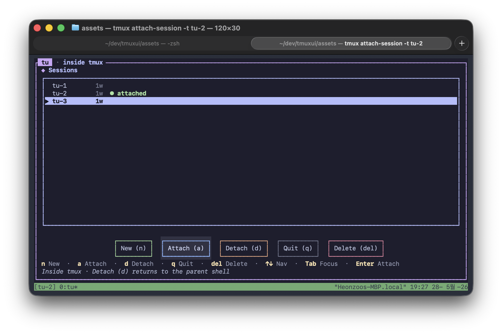
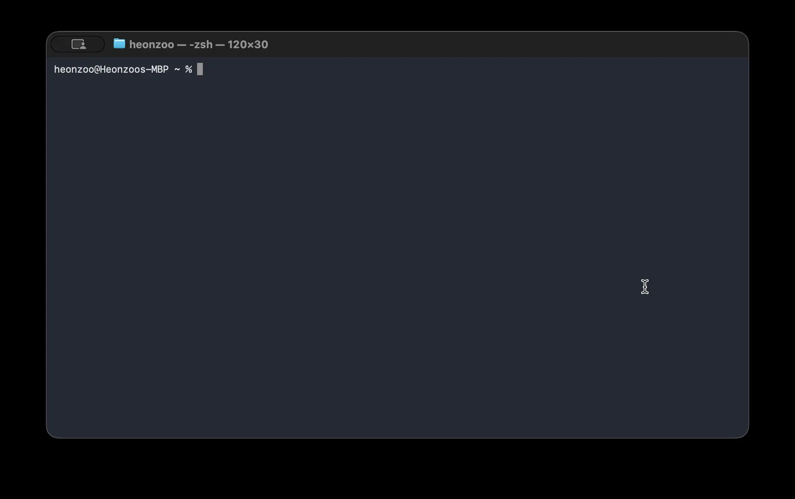

<div align="center">

# `tu`

**A tiny TUI menu on top of `tmux`.**
List, create, attach, detach, or delete sessions — keyboard
*and* mouse, no prefix-key gymnastics.

[](https://github.com/hungryZoo/tu/releases/latest)
[](LICENSE)
[](#install)
[](https://github.com/ratatui-org/ratatui)

<br/>



</div>

---

`tu` is a single 1.3 MB binary that opens a small picker over your
running `tmux` sessions. Pick one to attach, double-click to dive in,
**n** to spawn a fresh session, **d** to detach the current client,
**Delete** to kill a session (with a confirmation). Run it inside
tmux or from a fresh shell — it adapts.

<div align="center">



</div>

## Features

- **Session picker first, everything else second.** No preview,
  no command palette, no plugin system. Just the list.
- **Keyboard and mouse, in equal weight.** Hover lights up
  buttons, single-click selects, double-click attaches; every
  action also has a one-key shortcut.
- **Knows where it is.** Outside tmux, attach/new `execvp`s into
  `tmux attach-session` so you skip the flicker. Inside tmux,
  the same actions use `switch-client`; **Detach** becomes
  available.
- **Safe Delete.** `del` opens a confirmation modal with focus
  on *Back* — accidental Enter cancels.
- **Self-bootstrapping `~/.tmux.conf`.** First launch offers to
  append `set -g mouse on` and `set -g history-limit 10000000`,
  applies them to the running server, then asks you to restart
  `tu` so the new config takes effect cleanly.
- **Catppuccin Mocha** theme with proper focus, hover, press and
  disabled states across every widget.

## Install

### macOS — Homebrew tap

```bash
brew tap hungryZoo/tu https://github.com/hungryZoo/tu
brew install tu
```

The tap covers both Apple Silicon and Intel Macs; Homebrew picks
the right binary for you.

### Linux — `.deb` (Debian, Ubuntu, Raspberry Pi OS, …)

x86_64:

```bash
curl -LO https://github.com/hungryZoo/tu/releases/latest/download/tu_1.0.0_amd64.deb
sudo dpkg -i tu_1.0.0_amd64.deb
```

ARM64 (Pi 4 / 5 in 64-bit OS, AWS Graviton, …):

```bash
curl -LO https://github.com/hungryZoo/tu/releases/latest/download/tu_1.0.0_arm64.deb
sudo dpkg -i tu_1.0.0_arm64.deb
```

ARMv7 (Pi 2 / 3 / 4 / 5 in 32-bit Raspberry Pi OS):

```bash
curl -LO https://github.com/hungryZoo/tu/releases/latest/download/tu_1.0.0_armhf.deb
sudo dpkg -i tu_1.0.0_armhf.deb
```

### Linux — `.rpm` (Fedora, RHEL, CentOS, openSUSE, …)

x86_64:

```bash
sudo rpm -i https://github.com/hungryZoo/tu/releases/latest/download/tu-1.0.0-1.x86_64.rpm
```

ARM64:

```bash
sudo rpm -i https://github.com/hungryZoo/tu/releases/latest/download/tu-1.0.0-1.aarch64.rpm
```

### Anywhere — tarball

Grab the archive matching your platform from the
[latest release](https://github.com/hungryZoo/tu/releases/latest),
unpack it, drop the binary on `PATH`:

```bash
tar -xzf tu-1.0.0-<triple>.tar.gz
sudo install -m 0755 tu /usr/local/bin/tu
```

Triples available:

| Triple                          | Use it for                                      |
| ------------------------------- | ----------------------------------------------- |
| `aarch64-apple-darwin`          | macOS, Apple Silicon (M1/M2/M3/M4)              |
| `x86_64-apple-darwin`           | macOS, Intel                                    |
| `x86_64-unknown-linux-gnu`      | Linux x86_64, dynamic glibc                     |
| `x86_64-unknown-linux-musl`     | Linux x86_64, fully static                      |
| `aarch64-unknown-linux-gnu`     | Linux ARM64 (Raspberry Pi 3/4/5 in 64-bit OS)   |
| `aarch64-unknown-linux-musl`    | Linux ARM64, fully static                       |
| `armv7-unknown-linux-gnueabihf` | Raspberry Pi 2/3/4/5 running 32-bit Pi OS       |

`musl` builds are statically linked and need nothing on the host;
`gnu` builds are smaller but require glibc ≥ 2.17.

### Verifying

Every release ships a `SHA256SUMS` file. After downloading any
asset, run:

```bash
shasum -a 256 -c SHA256SUMS --ignore-missing
```

### From source

```bash
git clone https://github.com/hungryZoo/tu.git
cd tu
cargo install --path .
```

That drops `tu` into `~/.cargo/bin`. Requires Rust 1.78+;
`cargo test` runs ~40 unit tests.

## Quickstart

Just run it. `tu` figures out whether you're inside tmux:

```bash
tu
```

- **Outside tmux** → pick a session (or create one) and the shell
  hands itself over to `tmux attach-session`.
- **Inside tmux**  → pick a session (`switch-client`) or
  press **d** / click **Detach** to return to the parent shell.

Optional, but very nice — bind a hotkey in `~/.tmux.conf` so
`F12` pops `tu` over your work from any pane:

```tmux
bind-key -n F12 display-popup -E "tu"
```

## Behavior

`tu` behaves a little differently depending on whether you
launched it from your parent shell or from inside a tmux pane.

### From the parent shell (outside tmux)

1. Run `tu` — the menu opens in the parent shell.
2. Pick a session with ↑/↓ + **Enter** (or double-click a row,
   or click **Attach**) → `tu` closes and the parent shell
   `execvp`s into `tmux attach-session -t <name>`. Detaching
   from tmux later lands you back at the parent shell, not
   at `tu`.
3. **n** / **New** creates a fresh `tu-N` session and attaches
   to it via the same hand-off.
4. **q** / **Quit** just closes `tu`.

**Detach** is greyed out: there is no tmux client to detach.

### From a tmux pane (inside tmux)

1. Run `tu` inside a tmux pane.
2. Pick / create works the same, except the existing client is
   moved with `tmux switch-client -t <name>`.
3. **d** / **Detach** runs `tmux detach-client -s <session>`
   (the session is resolved from `$TMUX_PANE`) so the current
   client detaches and you land back at the parent shell — and
   `tu` closes too.

If a tmux command fails, `tu` stays open and surfaces the
actual error in its status line.

### Deleting a session

Hard-deletes are gated by a confirmation modal so a single
keystroke can't nuke anything.

1. Highlight a row, press **Delete** (or click the red **Delete**
   button).
2. *"Really delete session 'X'? This cannot be undone."* opens
   with focus on **Back** — Enter cancels by default.
3. Tab to **Delete**, hit Enter (or click it). On confirm, `tu`
   runs `tmux kill-session -t <name>` and refreshes the list.

> macOS laptops use **fn + delete** for the forward-Delete key.

### `~/.tmux.conf` baseline

On every launch `tu` checks for two directives:

| Directive                       | Why                                    |
| ------------------------------- | -------------------------------------- |
| `set -g mouse on`               | Clicks + scroll work everywhere        |
| `set -g history-limit 10000000` | A generously-sized scrollback buffer   |

If either is missing, a modal offers to add it. Picking **Yes,
add** will:

1. Append the missing lines to **the end** of `~/.tmux.conf`
   under a `# Added by tu` header. tmux's last-line-wins rule
   keeps these authoritative even if an older conflicting line
   sits higher up.
2. Apply them to the running server with `tmux set-option -g`.
3. Show a *"restart tu"* notice — press Enter and `tu` exits so
   your next launch starts from a clean slate.

If you've deliberately set `mouse off` (or any explicit value),
`tu` respects it: the modal stays away.

### Mouse, in detail

Crossterm exposes the full mouse event stream — including
`MouseEventKind::Moved` — so `tu` implements:

- **Hover** — buttons brighten, list rows tint subtly.
- **Press / release** — mousedown latches the *pressed* style;
  release on the same widget fires the action, release off
  cancels.
- **Click-to-focus** — clicking a button also moves keyboard
  focus there.
- **Single vs. double click on the list** — a single click
  selects a row without attaching; a double click within
  ~450 ms on the same row attaches.
- **Wheel** — scrolling moves the selection in the session
  list regardless of where the cursor lives.

Modern terminals (iTerm2, Alacritty, kitty, recent Apple
Terminal / gnome-terminal) report motion events by default;
inside tmux, the `set -g mouse on` baseline above is what gets
them forwarded.

## Repository layout

```
src/
├── lib.rs          # crate root for unit tests
├── main.rs         # binary entry point (clap + execvp hand-off)
├── models.rs       # Session struct + tab-delimited parser
├── tmux.rs         # thin wrapper over the `tmux` CLI
├── conf_setup.rs   # ~/.tmux.conf directive detection / patching
├── state.rs        # AppState, Screen, Focus, ButtonId, hit-test
├── theme.rs        # Catppuccin Mocha palette + per-state styles
├── view.rs         # render(): pure ratatui draw functions
└── app.rs          # crossterm event loop + action dispatch
```

## Building releases

Cross-compiling to Linux from macOS uses
[`cargo-zigbuild`](https://github.com/rust-cross/cargo-zigbuild)
with `zig` as the C linker, so no Docker / Linux toolchain is
required.

One-time toolchain setup:

```bash
brew install zig
cargo install --locked cargo-zigbuild cargo-deb cargo-generate-rpm
rustup target add \
  aarch64-apple-darwin x86_64-apple-darwin \
  x86_64-unknown-linux-gnu x86_64-unknown-linux-musl \
  aarch64-unknown-linux-gnu aarch64-unknown-linux-musl \
  armv7-unknown-linux-gnueabihf
```

Build every binary, then package tarballs + `.deb` + `.rpm` +
`SHA256SUMS` into `dist/`:

```bash
bash scripts/build-all.sh
bash scripts/package-all.sh
```

## Roadmap

- [ ] Publish a proper Homebrew tap repo (`hungryZoo/homebrew-tu`)
      with bottles per platform.
- [ ] AUR + Arch Linux packaging.
- [ ] Self-hosted apt repo on GitHub Pages so `apt install tu`
      works on Debian / Raspberry Pi OS.

PRs welcome — see [Contributing](#contributing).

## Contributing

1. Fork, branch, commit with a conventional-commits prefix
   (`feat:`, `fix:`, `chore:`).
2. Run `cargo fmt`, `cargo clippy --all-targets -- -D warnings`,
   and `cargo test` before pushing.
3. Open a PR against `main`. Small, scoped PRs are far easier
   to land.

The Python prototype (Textual) lives on the
[`python-legacy`](https://github.com/hungryZoo/tu/tree/python-legacy)
branch, tagged
[`v0.9.0`](https://github.com/hungryZoo/tu/releases/tag/v0.9.0).
It's frozen — bug-fix PRs there will be considered, but new
features go into the Rust tree.

## License

[MIT](LICENSE) © hungryZoo
