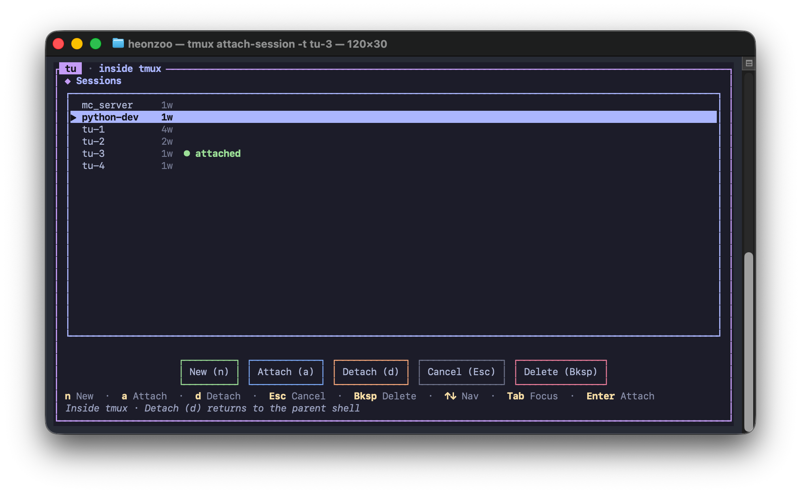
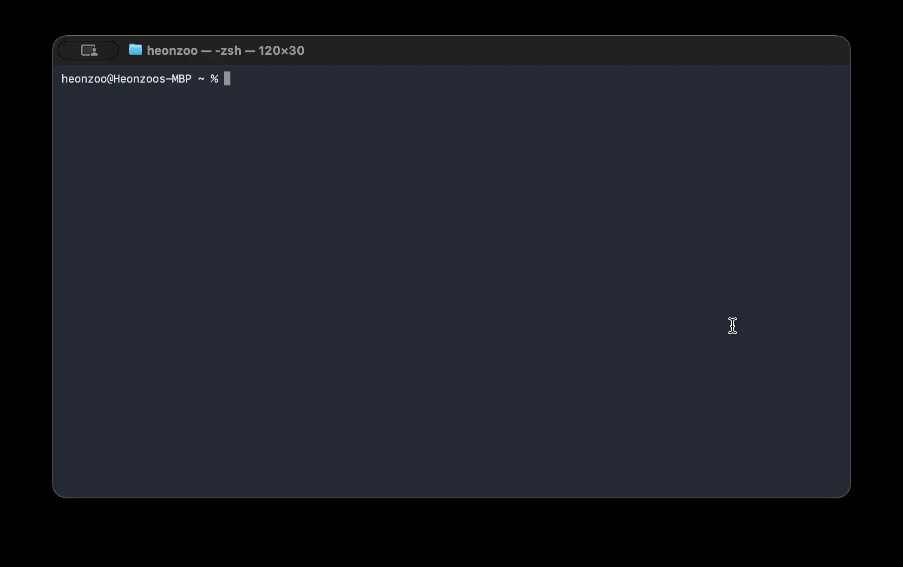

<div align="center">

# `tu`

**A tiny TUI menu on top of `tmux`.**
List, create, attach, detach, or delete sessions — keyboard
*and* mouse, no prefix-key gymnastics.

[](https://github.com/hungryZoo/tu/releases/latest)
[](LICENSE)
[](#install)
[](https://github.com/ratatui-org/ratatui)

<br/>



</div>

---

`tu` is a single ~1.5 MB binary that opens a small picker over your
running `tmux` sessions. Pick one to attach, double-click to dive in,
**n** to spawn a fresh session, **d** to detach the current client,
**Backspace** to kill a session (with a confirmation). Run it from a
fresh shell, from a tmux pane (it opens full-screen over your work),
or click the **tu** button it puts on your tmux status bar.

<div align="center">



</div>

## Features

- **Session picker first, everything else second.** No preview,
  no command palette, no plugin system. Just the list.
- **Keyboard and mouse, in equal weight.** Hover lights up
  buttons, single-click selects, double-click attaches; every
  action also has a one-key shortcut.
- **Knows where it is.** Outside tmux, attach/new `execvp`s into
  `tmux attach-session` so you skip the flicker. Inside tmux,
  the same actions use `switch-client`; **Detach** becomes
  available.
- **Full-screen popup inside tmux.** Run `tu` from any pane on
  tmux ≥ 3.2 and it re-launches itself in a `display-popup`
  covering the whole client, then hands the pane back when it
  closes. No window juggling. `--no-popup` (or `TU_NO_POPUP=1`)
  keeps the old inline behaviour.
- **A `tu` button on the status bar.** One click on the bold
  ` tu ` label at the right end of tmux's status line opens the
  same full-screen popup — handy when something is running in
  every pane.
- **Safe Delete.** **Backspace** (or forward-Delete) opens a
  confirmation modal with focus on *Back* — accidental Enter
  cancels. **Esc** / **Cancel** just closes `tu`.
- **Self-bootstrapping `~/.tmux.conf`.** First launch offers to
  append `set -g mouse on`, `set -g history-limit 10000000` and
  the status-bar button, applies them to the running server,
  then asks you to restart `tu` so the new config takes effect
  cleanly.
- **Catppuccin Mocha** theme with proper focus, hover, press and
  disabled states across every widget.

## Install

### Quick install (macOS & Linux, no sudo)

Detects your OS/arch, downloads the matching release binary, and
installs it to `~/.local/bin`:

```bash
curl -fsSL https://raw.githubusercontent.com/hungryZoo/tu/main/install.sh | sh
```

Pin a version or pick a different directory:

```bash
TU_VERSION=1.1.1 TU_INSTALL_DIR=~/bin curl -fsSL .../install.sh | sh
```

If `~/.local/bin` is not on your `PATH` yet, add this to
`~/.zshrc` / `~/.bashrc`:

```bash
export PATH="$HOME/.local/bin:$PATH"
```

`tmux` must be installed separately — the installer only ships
the `tu` binary.

### macOS / Linux — Homebrew tap

```bash
brew tap hungryZoo/tap
brew install hungryZoo/tap/tu
```

The formula lives in [hungryZoo/homebrew-tap](https://github.com/hungryZoo/homebrew-tap)
and covers Apple Silicon and Intel Macs plus x86_64 / aarch64 Linux;
Homebrew picks the right binary for you.

### From crates.io

```bash
cargo install tmux-tu
```

The crate is `tmux-tu` (plain `tu` was taken); the binary is still `tu`.

### Linux — system packages (optional, needs sudo)

`.deb` (Debian, Ubuntu, Raspberry Pi OS, …):

```bash
# x86_64
curl -LO https://github.com/hungryZoo/tu/releases/latest/download/tu_1.1.1_amd64.deb
sudo dpkg -i tu_1.1.1_amd64.deb

# ARM64 (Pi 4/5 64-bit OS, AWS Graviton, …)
curl -LO https://github.com/hungryZoo/tu/releases/latest/download/tu_1.1.1_arm64.deb
sudo dpkg -i tu_1.1.1_arm64.deb

# ARMv7 (32-bit Raspberry Pi OS)
curl -LO https://github.com/hungryZoo/tu/releases/latest/download/tu_1.1.1_armhf.deb
sudo dpkg -i tu_1.1.1_armhf.deb
```

`.rpm` (Fedora, RHEL, CentOS, openSUSE, …):

```bash
# x86_64
sudo rpm -i https://github.com/hungryZoo/tu/releases/latest/download/tu-1.1.1-1.x86_64.rpm

# ARM64
sudo rpm -i https://github.com/hungryZoo/tu/releases/latest/download/tu-1.1.1-1.aarch64.rpm
```

### Manual — tarball

Grab the archive matching your platform from the
[latest release](https://github.com/hungryZoo/tu/releases/latest),
unpack it, and copy the binary somewhere on `PATH` — no sudo
needed if you use a user-writable directory:

```bash
tar -xzf tu-1.1.1-<triple>.tar.gz
mkdir -p ~/.local/bin
install -m 0755 tu ~/.local/bin/tu
```

Triples available:

| Triple                          | Use it for                                      |
| ------------------------------- | ----------------------------------------------- |
| `aarch64-apple-darwin`          | macOS, Apple Silicon (M1/M2/M3/M4)              |
| `x86_64-apple-darwin`           | macOS, Intel                                    |
| `x86_64-unknown-linux-gnu`      | Linux x86_64, dynamic glibc                     |
| `x86_64-unknown-linux-musl`     | Linux x86_64, fully static                      |
| `aarch64-unknown-linux-gnu`     | Linux ARM64 (Raspberry Pi 3/4/5 in 64-bit OS)   |
| `aarch64-unknown-linux-musl`    | Linux ARM64, fully static                       |
| `armv7-unknown-linux-gnueabihf` | 32-bit ARMv7 boards (Pi 2 and up on 32-bit OS)  |
| `arm-unknown-linux-gnueabihf`   | 32-bit ARMv6: Raspberry Pi 1, Zero, Zero W      |

`musl` builds are statically linked and need nothing on the host;
`gnu` builds are smaller but require glibc ≥ 2.17.

#### Raspberry Pi cheat sheet

Which asset you need depends on the SoC *and* on whether you run a
64-bit or 32-bit Raspberry Pi OS. The `armhf` `.deb` is built from
the ARMv6 binary, so it installs on every 32-bit Pi OS.

| Model                                   | SoC     | CPU                    | 64-bit OS                        | 32-bit OS                                          |
| --------------------------------------- | ------- | ---------------------- | -------------------------------- | -------------------------------------------------- |
| Pi 1 A/B/A+/B+, Zero, Zero W            | BCM2835 | ARM1176 (ARMv6)        | not available                    | `arm-unknown-linux-gnueabihf` / `armhf.deb`       |
| Pi 2 B v1.1                             | BCM2836 | Cortex-A7 (ARMv7)      | not available                    | `armv7-unknown-linux-gnueabihf` / `armhf.deb`     |
| Pi 2 B v1.2, Pi 3 B/B+/A+, Zero 2 W     | BCM2837 | Cortex-A53 (ARMv8)     | `aarch64-*` / `arm64.deb`        | `armv7-unknown-linux-gnueabihf` / `armhf.deb`     |
| Pi 4 B, Pi 400, CM4                     | BCM2711 | Cortex-A72 (ARMv8)     | `aarch64-*` / `arm64.deb`        | `armv7-unknown-linux-gnueabihf` / `armhf.deb`     |
| Pi 5, Pi 500, CM5                       | BCM2712 | Cortex-A76 (ARMv8.2)   | `aarch64-*` / `arm64.deb`        | `armv7-unknown-linux-gnueabihf` / `armhf.deb`     |

`install.sh` picks the right one from `uname -m` (`aarch64`,
`armv7l`, `armv6l`). A 32-bit Pi OS image on a Pi 4/5 boots a
64-bit kernel, so `uname -m` reports `aarch64` there and the
installer hands you the static `aarch64-unknown-linux-musl` build,
which runs fine on that setup.

### Verifying

Every release ships a `SHA256SUMS` file. After downloading any
asset, run:

```bash
shasum -a 256 -c SHA256SUMS --ignore-missing
```

### From source

```bash
git clone https://github.com/hungryZoo/tu.git
cd tu
cargo install --path .
```

That drops `tu` into `~/.cargo/bin`. Requires Rust 1.78+;
`cargo test` runs ~50 unit tests.

## Quickstart

Just run it. `tu` figures out whether you're inside tmux:

```bash
tu
```

- **Outside tmux** → pick a session (or create one) and the shell
  hands itself over to `tmux attach-session`.
- **Inside tmux**  → `tu` opens full-screen in a popup over the
  current client. Pick a session (`switch-client`) or press
  **d** / click **Detach** to return to the parent shell.
- **From the status bar** → click the ` tu ` button at the right
  end of the bar (added on first launch, see below).

Optional — bind a hotkey too, so `F12` opens the same popup from
any pane:

```tmux
bind-key -n F12 display-popup -E -B -w 100% -h 100% "tu"
```

(`-B` needs tmux ≥ 3.3; drop it on 3.2.)

## Behavior

`tu` behaves a little differently depending on whether you
launched it from your parent shell or from inside a tmux pane.

### From the parent shell (outside tmux)

1. Run `tu` — the menu opens in the parent shell.
2. Pick a session with ↑/↓ + **Enter** (or double-click a row,
   or click **Attach**) → `tu` closes and the parent shell
   `execvp`s into `tmux attach-session -t <name>`. Detaching
   from tmux later lands you back at the parent shell, not
   at `tu`.
3. **n** / **New** creates a fresh `tu-N` session and attaches
   to it via the same hand-off.
4. **Esc** / **Cancel** just closes `tu`.

**Detach** is greyed out: there is no tmux client to detach.

### From a tmux pane (inside tmux)

1. Run `tu` inside a tmux pane. On tmux ≥ 3.2 the pane instance
   asks the server for `display-popup -E -w 100% -h 100%` (plus
   `-B` on ≥ 3.3) running the same binary, and waits for the
   popup to close. Older tmux draws inline in the pane.
2. Pick / create works the same, except the existing client is
   moved with `tmux switch-client -t <name>`.
3. **d** / **Detach** runs `tmux detach-client` so the current
   client detaches and you land back at the parent shell — and
   `tu` closes too.

The popup instance knows it is a popup because tmux exports
`$TMUX` but no `$TMUX_PANE` to it, so it never opens a second
popup — which also means your own `display-popup ... tu` bindings
keep working unchanged.

### From the status bar

The `~/.tmux.conf` block below draws a bold ` tu ` label at the
right end of the status line and binds a left click on it to the
same full-screen popup. Clicks anywhere else on the bar keep
tmux's default (select the window under the pointer).

If a tmux command fails, `tu` stays open and surfaces the
actual error in its status line.

### Deleting a session

Hard-deletes are gated by a confirmation modal so a single
keystroke can't nuke anything.

1. Highlight a row, press **Backspace** (or forward-Delete, or
   click the red **Delete** button).
2. *"Really delete session 'X'? This cannot be undone."* opens
   with focus on **Back** — Enter cancels by default.
3. Tab to **Delete**, hit Enter (or click it). On confirm, `tu`
   runs `tmux kill-session -t <name>` and refreshes the list.

> On Mac keyboards the key labelled *delete* is Backspace, which
> is exactly what `tu` listens for. **fn + delete** works too.

### `~/.tmux.conf` baseline

On every launch `tu` checks for three things:

| Item                            | Why                                    |
| ------------------------------- | -------------------------------------- |
| `set -g mouse on`               | Clicks + scroll work everywhere        |
| `set -g history-limit 10000000` | A generously-sized scrollback buffer   |
| status-bar ` tu ` button        | One-click launch from any window (tmux ≥ 3.2) |

If anything is missing, a modal offers to add it. Picking **Yes,
add** will:

1. Append the missing lines to **the end** of `~/.tmux.conf`
   between a `# Added by tu` header and a `# End of tu` footer.
   tmux's last-line-wins rule keeps these authoritative even if
   an older conflicting line sits higher up.
2. Apply them to the running server (`set-option -g`,
   `set-option -ga status-right`, `bind-key -T root`).
3. Show a *"restart tu"* notice — press Enter and `tu` exits so
   your next launch starts from a clean slate.

A fresh `~/.tmux.conf` ends up with:

```tmux
# Added by tu (https://github.com/hungryZoo/tu)
set -g mouse on
set -g history-limit 10000000
set -g status-right-length 60
set -ag status-right "#[range=user|tu]#[fg=#1e1e2e,bg=#cba6f7,bold] tu #[norange]#[default]"
bind -T root MouseDown1Status \
  if -F '#{==:#{mouse_status_range},tu}' \
    'display-popup -E -B -w 100% -h 100% tu' \
    'select-window -t ='
# End of tu
```

`-B` is written only on tmux ≥ 3.3; on 3.2 the popup keeps its
border. Below 3.2 the button is never offered.

If you've deliberately set `mouse off` (or any explicit value),
`tu` respects it: the modal stays away. The button is recognised
by its `range=user|tu` marker, so you can restyle or move it and
`tu` will still consider it configured.

The bind runs plain `tu`, resolved through the tmux server's
`PATH`. If you installed to `~/.local/bin` and tmux was started
from a shell that doesn't put it on `PATH`, point the binding at
the absolute path instead.

### Mouse, in detail

Crossterm exposes the full mouse event stream — including
`MouseEventKind::Moved` — so `tu` implements:

- **Hover** — buttons brighten, list rows tint subtly.
- **Press / release** — mousedown latches the *pressed* style;
  release on the same widget fires the action, release off
  cancels.
- **Click-to-focus** — clicking a button also moves keyboard
  focus there.
- **Single vs. double click on the list** — a single click
  selects a row without attaching; a double click within
  ~450 ms on the same row attaches.
- **Wheel** — scrolling moves the selection in the session
  list regardless of where the cursor lives.

Modern terminals (iTerm2, Alacritty, kitty, recent Apple
Terminal / gnome-terminal) report motion events by default;
inside tmux, the `set -g mouse on` baseline above is what gets
them forwarded.

## Repository layout

```
src/
├── lib.rs          # crate root for unit tests
├── main.rs         # binary entry point (clap, popup re-launch, execvp hand-off)
├── models.rs       # Session struct + tab-delimited parser
├── tmux.rs         # thin wrapper over the `tmux` CLI
├── conf_setup.rs   # ~/.tmux.conf directives + status-bar button
├── state.rs        # AppState, Screen, Focus, ButtonId, hit-test
├── theme.rs        # Catppuccin Mocha palette + per-state styles
├── view.rs         # render(): pure ratatui draw functions
└── app.rs          # crossterm event loop + action dispatch
```

## Building releases

### From GitHub Actions (the normal path)

The [`release`](.github/workflows/release.yml) workflow does the
whole thing on one Ubuntu runner: cross-builds all eight targets
with `cargo-zigbuild` (macOS included), packages tarballs +
`.deb` + `.rpm` + `SHA256SUMS`, publishes the GitHub release, pushes
the new checksums to `Formula/tu.rb` in
[hungryZoo/homebrew-tap](https://github.com/hungryZoo/homebrew-tap),
and publishes the crate to crates.io.

The last two steps need repository secrets and are skipped with a
warning when they are missing:

| Secret | What it is |
|---|---|
| `HOMEBREW_TAP_TOKEN` | Fine-grained GitHub PAT scoped to `hungryZoo/homebrew-tap`, Contents: read/write |
| `CARGO_REGISTRY_TOKEN` | crates.io API token with publish scope |

To cut a release:

1. Bump `version` in `Cargo.toml`, add
   `.github/release-notes/vX.Y.Z.md` (the first `# heading` becomes
   the release title), merge to `main`.
2. Either push a tag — `git tag vX.Y.Z && git push origin vX.Y.Z` —
   or open *Actions → release → Run workflow* on `main`, which
   creates the tag for you if it doesn't exist.

The workflow refuses a tag whose version doesn't match `Cargo.toml`.

### Locally (macOS)

Cross-compiling to Linux from macOS uses
[`cargo-zigbuild`](https://github.com/rust-cross/cargo-zigbuild)
with `zig` as the C linker, so no Docker / Linux toolchain is
required.

One-time toolchain setup:

```bash
brew install zig
cargo install --locked cargo-zigbuild cargo-deb cargo-generate-rpm
rustup target add \
  aarch64-apple-darwin x86_64-apple-darwin \
  x86_64-unknown-linux-gnu x86_64-unknown-linux-musl \
  aarch64-unknown-linux-gnu aarch64-unknown-linux-musl \
  armv7-unknown-linux-gnueabihf arm-unknown-linux-gnueabihf
```

Build every binary, then package tarballs + `.deb` + `.rpm` +
`SHA256SUMS` into `dist/`:

```bash
bash scripts/build-all.sh
bash scripts/package-all.sh          # version comes from Cargo.toml
scripts/update-formula.sh 1.1.1 dist/SHA256SUMS   # refresh the tap
```

## Roadmap

- [x] Formula lives in the shared tap repo (`hungryZoo/homebrew-tap`).
- [ ] Bottles per platform.
- [ ] AUR + Arch Linux packaging.
- [ ] Self-hosted apt repo on GitHub Pages so `apt install tu`
      works on Debian / Raspberry Pi OS.

PRs welcome — see [Contributing](#contributing).

## Contributing

1. Fork, branch, commit with a conventional-commits prefix
   (`feat:`, `fix:`, `chore:`).
2. Run `cargo fmt`, `cargo clippy --all-targets -- -D warnings`,
   and `cargo test` before pushing.
3. Open a PR against `main`. Small, scoped PRs are far easier
   to land.

The Python prototype (Textual) lives on the
[`python-legacy`](https://github.com/hungryZoo/tu/tree/python-legacy)
branch, tagged
[`v0.9.0`](https://github.com/hungryZoo/tu/releases/tag/v0.9.0).
It's frozen — bug-fix PRs there will be considered, but new
features go into the Rust tree.

## License

[MIT](LICENSE) © hungryZoo
